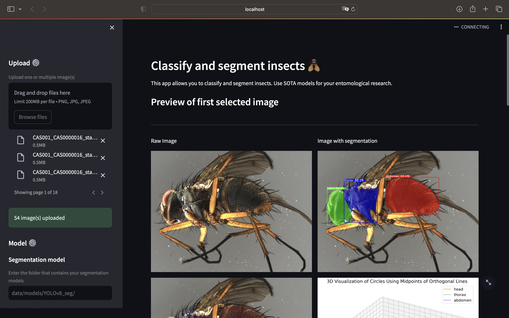

# tachinidae-analyzer: Part II - Deployment

> NOTE :rotating_light:  
> If you are interested in developing and training models, the repository [tachinidae-detector](https://gitlab.kit.edu/kit/iai/ber/tachinidae-detector.git) may be more suitable (with GUI).

Tachinidae Analyzer is a web-based application designed for classifying and segmenting insects in images. This tool leverages state-of-the-art models to aid entomological research and analysis. This repo is providing a GUI for the models that got trained during the developement of [tachinidae-detector](https://gitlab.kit.edu/kit/iai/ber/tachinidae-detector.git) repository. It is based on the [streamlit](https://streamlit.io/) framework.

Quick feature overview:
- Upload and process insect images.
- Perform image segmentation to identify insect parts.
- Display color histograms and area ratios for analyzed images.
- Download results in various formats, including segmented images and analysis data.

This repository is part of a master thesis at the Karlsruhe Institute of Technology (KIT) at the Institute for Automation and Applied Informatics (IAI).

Masterthesis: Automated Instance Segmentation and Taxonomic Classification Using Machine Learning Models to Support Biodiversity Research on Tachinid Flies
Author: Joshua Albiez (uvtoc@student.kit.edu)

# Table of contents
- [Installation](#installation)
- [Getting started](#getting-started)
    - [Workflow/Pipeline overview](#workflow/pipeline-overview)
    - [0. Download data](#0-download-data)
- [Contributing](#contributing)
    - [Tips and tricks](#tips-and-tricks)
        - [Transfer data between device and server](#transfer-data-between-device-and-server)

# Installation Guide

## Prerequisites

Ensure that you have Miniconda installed on your system for managing virtual environments and dependencies. If Miniconda is not already installed, download it from the [miniconda official website](https://docs.conda.io/en/latest/miniconda.html). This guide assumes the use of Python 3.11.

## Installation Steps


### 1. Clone the Repository
(requires [git](https://git-scm.com/book/de/v2/Erste-Schritte-Git-installieren) to be installed on your system) 
```bash
git clone https://github.com/JoshAlb21/tachinidae_analyzer
```
OR
(does not require git to be installed on your system)
simply download the repo as zip file (unzip after download)

### 2. Download Docker for your OS

[Docker](https://www.docker.com/get-started/) (makes sure that every user runs the same environment and requirements like python etc. are properly installed despite using a different OS.)
   
### 3. Setup required tools 
by using a shell(.sh) script for MacOS or Linux and bash(.bat) script for Windows:
   
- MacOS and Linux:
    - a. make the scripts executable
    ```bash
    chmod +x install_app.sh
    ```
    and 
    ```bash
    chmod +x start_app.sh
    ```

    - b. Finally you can install the app (will also open the app for the first time after installation)
    ```bash
    ./run_streamlit_app.sh
    ```

- Windows:
    Install the app (opens it at the first time) by
    Double Clicking the install_app.bat file

# Getting started

## Usage

Note: The app runs locally on your computer after installation. This means that all data or images that you want to use for your analysis, including the results, are only stored locally and are not uploaded to a cloud (the "Upload" button is therefore somewhat misleading, as it only means uploading to the local application). If you are interested in using a hosted version of the app, just contact me at the following email address: uvtoc@student.kit.edu. Even a self-hosted app internally in your organisation's network is easily possible due to Docker containers.



## Start the app (after succesfull installation)
The application is ready to use as soon as it is succesfully installed.

MacOS/Linux:
open a terminal inside the downloaded folder and type
```bash
   ./start_app.sh
```

Windows:
Double-Click on file
```shell
   start_app.bat
```
## Overview

The sidebar is used to adjust different settings. Here you can choose the image(s) you want to perform inference on. Given the path where you store your models (pt or pth files), you will be able to select the model you want to use.
After performing the inference you will be able to select which files you want to download.

In case you want to perform the prediction for reintegration purposes of new data, you should download the json annotation files. These you can use with the corresponding image file (has to have the same name and should be stored within same folder!) to annotate them with the opensource software "labelme".

### Side Panel
1. **File Upload Section**: Users can upload images for classification and segmentation.
2. **Model Settings**: Options for users to select models for segmentation and classification tasks.
3. **Volume Estimation Settings**: Users can set parameters for volume estimation, such as millimeters per pixel, fallback polynomial degree, and the number of orthogonal lines.

### Main Panel
1. **Application Introduction**: Displays the app's purpose - classifying and segmenting insects using state-of-the-art models.
2. **Preview of First Selected Image**: Shows the first image uploaded by the user.
3. **Insights & Analysis for Single Image**:
   - **Color Histogram**: Displayed in one column.
   - **Area Ratio**: Shown in another column.
4. **Image Segmentation Section**:
   - If images are uploaded and a segmentation model is selected, the app performs segmentation.
   - Displays color histograms and area ratios for the first uploaded image.
   - Shows volume estimation results in a table.
   - Presents a skeletal image with orthogonal lines and a 3D volume visualization.
5. **Image Classification Section**:
   - Activated if images are uploaded and a classification model is chosen.
   - Displays classification results, including class names and confidence levels, for the first uploaded image.
6. **General Processing Section**:
   - Handles various processing scenarios: segmentation only, classification only, both, or neither.
   - Provides options to download different data types (e.g., CSV files, segmented images, volume estimation images, annotation zip files).
7. **Insights & Analysis for Multiple Images**:
   - **Volume Estimation and Length Estimation Visualizations**: Displays plots comparing volume and length estimations for different body parts across multiple images, categorized by class.


## Usage
After starting the application, follow these steps:

1. Upload insect images via the sidebar.
2. Select the model for classification and segmentation.
3. View the segmentation results and analysis in the main dashboard.
4. Download the results and segmented images as needed.


## Install updates
until now there is no option to install updates withouth re-installing the whole app. Make sure there is a new version of the app by checking the announcement on the github repo.
Then follow the steps described in section "Getting Started (GUI)" / "Installation".


## Getting Started (with programming knowledge)

### Contributing or Developing

Install package in editable mode 
```bash
pip install -e .
```
and run the following command to start the app:
```bash
streamlit run main_dashboard.py
```

### Run without script installation without package installation

python -m tachinidae_analyzer.perform_inference.inference_yolov8seg

### Examples
The examples folder contains various python script that can be used as inspiration for your own project (Note: some of them are not mantained anymore!)

1. run ex_yolov8seg_prediction_extraction -> result: df_segments.csv
2. run ex_yolov8seg_segments_analyzer -> df_segments_dataset.csv (df_segments.csv + TachinidaeID_export... .csv)
3. run ex_volume_estimation -> result: df_volumes.csv
4. run analyze_extracted_volumes -> result: df_merged.csv

### Run docker container
```bash
docker build -t streamlit .
```

```bash
docker run -p 8501:8501 streamlit
```

```bash
docker container ls --all
```

```bash
docker export 68b0fa2d9905 > streamlit.tar
```
